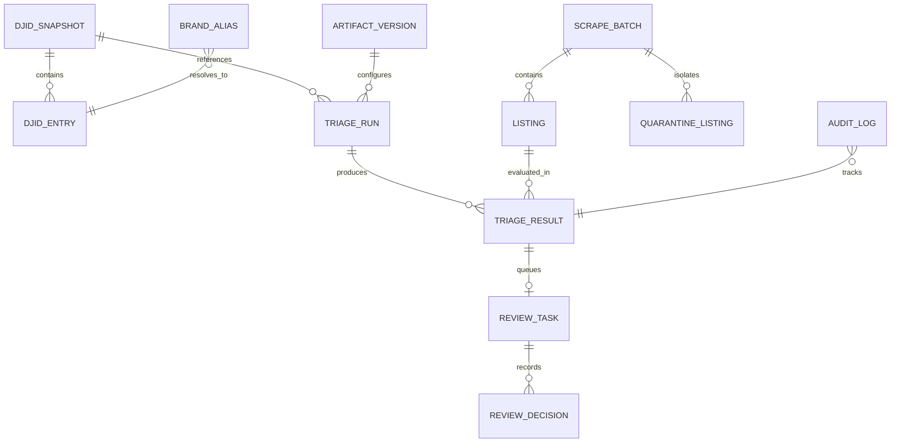

# DATA CONTRACT — SISTEM TRIASE SERTIFIKASI (SITRUS)

Dokumen ini mendefinisikan kontrak data lengkap:
1. **Skema Sumber Mentah** (Scraper Marketplace + Database DJID).
2. **Analisis Keandalan Kolom** (Kolom mana yang tidak dapat dipercaya dan alasannya).
3. **Skema Domain Aplikasi Terkelola** (PostgreSQL / SQLAlchemy).
4. **Kontrak Transformasi & Rekayasa Fitur** (Normalisasi Teks & Vektor Fitur).
5. **Kontrak Gold Set & Ekspor Anotasi**.

---

## 1. Skema Sumber Mentah

### 1.1 Dataset Listing Marketplace (`listing_marketplace.csv`)
Dihasilkan oleh ekstensi Chrome scraper (`sdppi_scraper_extension/content.js` dan `background.js`).

| Kolom Sumber | Tipe Data Asal | Arti Teknis Riil (Berdasarkan Kode Scraper) | Tingkat Keandalan |
|---|---|---|---|
| `web_scraper_order` | `string` | ID urutan scraping per-sesi, format `${Date.now()}-${idx}` (mis. `1782458402-1`). | **Rendah (Non-Unique)**: Tidak unik lintas sesi scraping atau penggabungan beberapa file CSV. |
| `web_scraper_start_url` | `string` | URL halaman toko/kategori (mis. `https://www.tokopedia.com/pusatht-official-store/product`). | **Rendah**: Bersifat *page-level/store-level*, bukan permalink produk. Jangan digunakan sebagai kunci identitas listing! |
| `data` | `string` | Teks harga mentah (mis. `Rp2.950.000` atau `Rp65000000`). | **Sedang**: Memerlukan parsing regex untuk konversi ke integer numerik. |
| `data2` | `string` | Judul produk marketplace mentah (mis. `Radio HT Handy Talky MagOne by Motorola X10d ...`). | **Tinggi untuk Identitas Teks**: Sumber data utama untuk inferensi entity resolution. |
| `data3` | `string` | Badge promo / diskon (mis. `Hemat s.d 5% Pakai Bonus`, `Mall`, `Cashback`). | **Rendah**: Informasi pemasaran sementara, tidak relevan untuk identifikasi legal sertifikasi. |
| `image` | `string` | URL gambar CDN Tokopedia/Shopee atau Google Drive link. | **Sangat Rendah**: URL CDN Tokopedia/Shopee memiliki masa kedaluwarsa (~1 jam) menghasilkan HTTP 401/403. Link Google Drive tidak menjamin persistensi. |

### 1.2 Basis Data Sertifikasi DJID (`DJID.csv`)
Diekstrak dari portal sertifikasi resmi DJID Kominfo.

| Kolom Sumber | Tipe Data Asal | Arti Teknis | Karakteristik & Keterbatasan |
|---|---|---|---|
| `web_scraper_order` | `string` | ID order scraper portal DJID. | Metadata scraper, diabaikan di domain. |
| `web_scraper_start_url` | `string` | URL endpoint portal DJID (`sertifikat-terbit`). | Metadata scraper. |
| `nomor_sertifikat` | `string` | Nomor izin edar / sertifikat resmi. | Format memiliki dua era: `.../SDPPI/2023` dan `.../DJID/2026` akibat perubahan nomenklatur kelembagaan. |
| `tanggal_terbit` | `string` | Tanggal penerbitan sertifikat (mis. `15 Jun 2026`, `10 Jun 2026`). | Format tanggal lokal bahasa Indonesia. |
| `plg_id` | `integer` | ID pemohon/pelanggan di basis data DJID. | Identitas relasional pemohon. |
| `nama_pemohon` | `string` | Nama badan hukum pemohon sertifikasi (mis. `PT CITRADATA PURNAKHARISMA`). | Terkadang mengandung spasi ganda. |
| `nama_perangkat` | `string` | Kategori perangkat telekomunikasi (mis. `Radio Portable / Two Way Radio`). | Bersifat generik/boilerplate pada perangkat sejenis. |
| `merk` | `string` | Merek dagang resmi perangkat (mis. `MOTOROLA`, `BAOFENG`, `ICOM`). | Kapitalisasi tidak konsisten (campuran huruf besar/kecil/spasi). |
| `model` | `string` | Nomor model perangkat (mis. `XiR P6600i`, `UV-5R`, `IC-V88`). | Mengandung variasi tanda hubung, spasi, atau varian (`UV - 5R`, `UV-5R`). |
| `nama_pemasaran` | `string` | Nama pemasaran komersial perangkat. | Sering kali redundan dengan kombinasi merk+model atau hanya memuat rentang pita frekuensi (mis. `MOTOROLA XiR P6600i UHF 403-470MHz`). |
| `negara` | `string` | Negara asal pembuatan perangkat (mis. `Malaysia`, `China`, `Japan`). | Informasi legal asal pabrikan. |

---

## 2. Kebijakan Keandalan Data & Aturan Karantina

1. **Prinsip *Zero Trust* pada Data Scraper**:
   - Seluruh file CSV listing diperlakukan sebagai masukan tidak tepercaya.
   - Pydantic schema validator dijalankan pada setiap baris ingest.
   - Baris yang tidak memiliki `data2` (judul kosong), `data2` < 5 karakter, atau format CSV rusak **ditolak ke tabel `quarantine_listing`** beserta kode error eksplisit. Baris tidak pernah dibuang diam-diam.
2. **Deduplikasi Listing Berbasis Hash Judul**:
   - Karena `web_scraper_order` dan `web_scraper_start_url` tidak unik per produk, deduplikasi dilakukan dengan **`hash_judul` = SHA-256(`clean_text(data2)`)**.
   - Listing dengan `hash_judul` yang sama dalam satu batch/arsip ditautkan sebagai kemunculan berulang.
3. **Penanganan Snapshot DJID**:
   - File `DJID.csv` tidak pernah dibaca berdasarkan `st_mtime` sistem berkas.
   - Setiap berkas DJID dicatat ke `djid_snapshot` dengan menghitung **SHA-256 Checksum** atas seluruh byte file dan mencatat tanggal snapshot resmi.

---

## 3. Skema Domain Aplikasi Terkelola (PostgreSQL 16)

### 3.1 Detail Tabel Basis Data

#### `djid_snapshot`
- `id` (UUID, PK)
- `tanggal_snapshot` (DATE, Not Null) — Tanggal acuan snapshot DJID.
- `checksum` (VARCHAR(64), Not Null, Unique) — SHA-256 konten file `DJID.csv`.
- `jumlah_entri` (INTEGER, Not Null)
- `catatan` (TEXT, Nullable)
- `dibuat_oleh` (VARCHAR(100), Not Null)
- `dibuat_pada` (TIMESTAMPTZ, Default NOW())

#### `djid_entry`
- `id` (UUID, PK)
- `snapshot_id` (UUID, FK `djid_snapshot.id`, Index)
- `nomor_sertifikat` (VARCHAR(100), Not Null, Index)
- `tanggal_terbit` (VARCHAR(50), Nullable)
- `plg_id` (INTEGER, Nullable)
- `nama_pemohon` (VARCHAR(255), Nullable)
- `nama_perangkat` (VARCHAR(255), Nullable)
- `merk` (VARCHAR(100), Not Null, Index)
- `model` (VARCHAR(150), Not Null, Index)
- `nama_pemasaran` (VARCHAR(255), Nullable)
- `negara` (VARCHAR(100), Nullable)
- `merk_norm` (VARCHAR(100), Not Null, Index) — Hasil `clean_text(merk)`.
- `model_norm` (VARCHAR(150), Not Null, Index) — Hasil `normalize_model(model)`.
- `dokumen_indexing` (TEXT, Not Null) — Dokumen representasi untuk dense/sparse index.

#### `brand_alias`
- `id` (UUID, PK)
- `alias` (VARCHAR(100), Not Null, Unique, Index) — Misal "POFUNG", "MAG ONE", "MAGONE".
- `merk_kanonik` (VARCHAR(100), Not Null, Index) — Misal "BAOFENG", "MOTOROLA".
- `sumber` (VARCHAR(50), Default 'analyst_rule') — Asal usul aturan alias.
- `dibuat_oleh` (VARCHAR(100), Not Null)
- `dibuat_pada` (TIMESTAMPTZ, Default NOW())

#### `scrape_batch`
- `id` (UUID, PK)
- `sumber` (VARCHAR(50), Not Null) — `tokopedia` / `shopee` / `manual_upload`.
- `waktu_scrape` (TIMESTAMPTZ, Not Null)
- `start_url` (TEXT, Nullable)
- `jumlah_baris` (INTEGER, Not Null)
- `file_asli` (VARCHAR(255), Nullable)
- `dibuat_pada` (TIMESTAMPTZ, Default NOW())

#### `listing`
- `id` (UUID, PK)
- `scrape_batch_id` (UUID, FK `scrape_batch.id`, Index)
- `judul_mentah` (TEXT, Not Null) — Nilai `data2` asli.
- `judul_bersih` (TEXT, Not Null) — `clean_text(judul_mentah)`.
- `judul_inti` (TEXT, Not Null) — `remove_noise(judul_mentah)`.
- `hash_judul` (VARCHAR(64), Not Null, Index) — SHA-256(`judul_bersih`).
- `harga_mentah` (VARCHAR(100), Nullable) — Nilai `data` asli.
- `harga_angka` (BIGINT, Nullable) — Nilai numerik integer harga.
- `url_start` (TEXT, Nullable) — Nilai `web_scraper_start_url`.
- `url_gambar` (TEXT, Nullable) — Nilai `image`.
- `nama_penjual` (VARCHAR(150), Nullable)
- `brand_terdeteksi` (VARCHAR(100), Nullable)
- `dibuat_pada` (TIMESTAMPTZ, Default NOW())

#### `quarantine_listing`
- `id` (UUID, PK)
- `scrape_batch_id` (UUID, FK `scrape_batch.id`)
- `baris_ke` (INTEGER, Not Null)
- `raw_payload` (JSONB, Not Null)
- `alasan_penolakan` (VARCHAR(255), Not Null)
- `dibuat_pada` (TIMESTAMPTZ, Default NOW())

#### `artifact_version`
- `id` (UUID, PK)
- `jenis` (VARCHAR(50), Not Null) — `embedding`, `dense_index`, `sparse_index`, `classifier`, `calibration`.
- `versi` (VARCHAR(50), Not Null)
- `checksum` (VARCHAR(64), Not Null)
- `snapshot_id` (UUID, FK `djid_snapshot.id`)
- `hyperparameter` (JSONB, Not Null)
- `metrik` (JSONB, Nullable) — Termasuk metrik evaluasi Recall@K dan kurva PR out-of-fold.
- `dibuat_pada` (TIMESTAMPTZ, Default NOW())

#### `triage_run`
- `id` (UUID, PK)
- `artifact_version_id` (UUID, FK `artifact_version.id`)
- `snapshot_id` (UUID, FK `djid_snapshot.id`)
- `ambang` (JSONB, Not Null) — `{"t_low": 0.30, "t_high": 0.80, "top_k": 20}`.
- `status_job` (VARCHAR(50), Not Null) — `PENDING`, `RUNNING`, `COMPLETED`, `FAILED`.
- `total_listing` (INTEGER, Default 0)
- `waktu_mulai` (TIMESTAMPTZ, Nullable)
- `waktu_selesai` (TIMESTAMPTZ, Nullable)
- `dijalankan_oleh` (VARCHAR(100), Not Null)

#### `triage_result`
- `id` (UUID, PK)
- `run_id` (UUID, FK `triage_run.id`, Index)
- `listing_id` (UUID, FK `listing.id`, Index)
- `status` (VARCHAR(50), Not Null, Index) — `TERSERTIFIKASI`, `PERLU_REVIEW`, `TERINDIKASI_TIDAK_BERSERTIFIKAT`.
- `reason_code` (VARCHAR(50), Not Null, Index) — `EXACT_MODEL_MATCH`, `HIGH_PROB_MATCH`, `BRAND_TIDAK_TERDETEKSI`, `BRAND_TIDAK_ADA_DI_DJID`, `MEREK_ADA_MODEL_TIDAK_DITEMUKAN`, `PROB_AMBIGU`.
- `keterangan` (TEXT, Not Null)
- `max_prob` (FLOAT, Not Null)
- `n_exact_hit` (INTEGER, Not Null)
- `kandidat_terbaik_id` (UUID, FK `djid_entry.id`, Nullable)
- `bukti` (JSONB, Not Null) — Seluruh Top-K kandidat retrieval semantik + detail exact match.
- `snapshot_date` (DATE, Not Null)

#### `review_task`
- `id` (UUID, PK)
- `triage_result_id` (UUID, FK `triage_result.id`, Unique)
- `status_antrean` (VARCHAR(50), Not Null, Index) — `MENUNGGU`, `SEDANG_DIKERJAKAN`, `SELESAI`.
- `prioritas` (INTEGER, Default 1)
- `ditugaskan_ke` (VARCHAR(100), Nullable)
- `dibuat_pada` (TIMESTAMPTZ, Default NOW())

#### `review_decision` (Gold Set Tesis)
- `id` (UUID, PK)
- `review_task_id` (UUID, FK `review_task.id`, Index)
- `keputusan_manusia` (VARCHAR(50), Not Null) — `MATCH`, `NOT_MATCH_UNLISTED`, `AMBIGUOUS`.
- `entri_djid_terpilih_id` (UUID, FK `djid_entry.id`, Nullable)
- `catatan` (TEXT, Nullable)
- `reviewer_id` (VARCHAR(100), Not Null)
- `durasi_detik` (INTEGER, Nullable)
- `waktu_putusan` (TIMESTAMPTZ, Default NOW())

#### `audit_log`
- `id` (UUID, PK)
- `aktor` (VARCHAR(100), Not Null)
- `aksi` (VARCHAR(100), Not Null) — `INGEST_BATCH`, `REBUILD_INDEX`, `CALIBRATE_THRESHOLDS`, `REVIEW_DECISION`, `EXPORT_REPORT`.
- `entitas` (VARCHAR(100), Not Null)
- `entitas_id` (VARCHAR(100), Not Null)
- `payload_sebelum` (JSONB, Nullable)
- `payload_sesudah` (JSONB, Nullable)
- `waktu` (TIMESTAMPTZ, Default NOW())
- `ip_address` (VARCHAR(50), Nullable)

---

## 4. Kontrak Transformasi Teks & Fitur

1. **`clean_text(text: str) -> str`**:
   - Lowercase, konversi karakter non-alfanumerik kecuali `-` menjadi spasi, kolaps spasi berlebih, strip whitespace.
2. **`normalize_model(m: str) -> str`**:
   - Menghapus semua karakter non-alfanumerik (termasuk `-` dan spasi), lowercase penuh (misal: `"IC-V88"` $\to$ `"icv88"`).
3. **`remove_noise(text: str) -> str`**:
   - Menghapus kata noise pemasaran yang didefinisikan secara tunggal pada `NOISE_WORDS` di `packages/ertriage/config.py`.
4. **Ekstraksi Fitur**:
   - `extract_features(...)` menerima parameter teks dan mengembalikan vektor berdimensi 7 (`FEATURES_PRODUCTION`) atau 5 (`FEATURES_EVALUABLE`).
   - Wajib identik secara byte antara pipeline `pipelines/build.py` (training) dan `packages/ertriage/features.py` (serving).
